# 🏗️ Architecture Documentation

This document provides a detailed overview of the Student Management System architecture, including system design, data flow, and component interactions.

---

## 📑 Table of Contents

- [System Overview](#system-overview)
- [Architecture Patterns](#architecture-patterns)
- [Detailed Architecture Diagrams](#detailed-architecture-diagrams)
- [Data Flow](#data-flow)
- [Authentication Flow](#authentication-flow)
- [Authorization Model](#authorization-model)
- [Database Design](#database-design)
- [Security Architecture](#security-architecture)

---

## System Overview

The Student Management System follows a **Model-View-Controller (MVC)** architecture pattern, implemented using Laravel's framework conventions. The system is designed with separation of concerns, making it maintainable and scalable.

### Architecture Layers

```
┌─────────────────────────────────────────────────────────┐
│                    Presentation Layer                    │
│              (Blade Templates / Views)                   │
└─────────────────────────────────────────────────────────┘
                          ↕
┌─────────────────────────────────────────────────────────┐
│                    Controller Layer                     │
│         (Business Logic / Request Handling)             │
└─────────────────────────────────────────────────────────┘
                          ↕
┌─────────────────────────────────────────────────────────┐
│                      Model Layer                         │
│            (Data Access / Eloquent ORM)                  │
└─────────────────────────────────────────────────────────┘
                          ↕
┌─────────────────────────────────────────────────────────┐
│                    Database Layer                        │
│              (MySQL / PostgreSQL)                        │
└─────────────────────────────────────────────────────────┘
```

---

## Architecture Patterns

### 1. MVC Pattern

The application follows Laravel's MVC pattern:

- **Models**: Represent data structures (`User`, `Student`)
- **Views**: Blade templates for presentation
- **Controllers**: Handle HTTP requests and business logic

### 2. Repository Pattern (Implicit)

Data access is abstracted through Eloquent models, providing a clean interface to the database.

### 3. Middleware Pattern

Request filtering and authentication handled through middleware stack.

---

## Detailed Architecture Diagrams

### Complete System Architecture

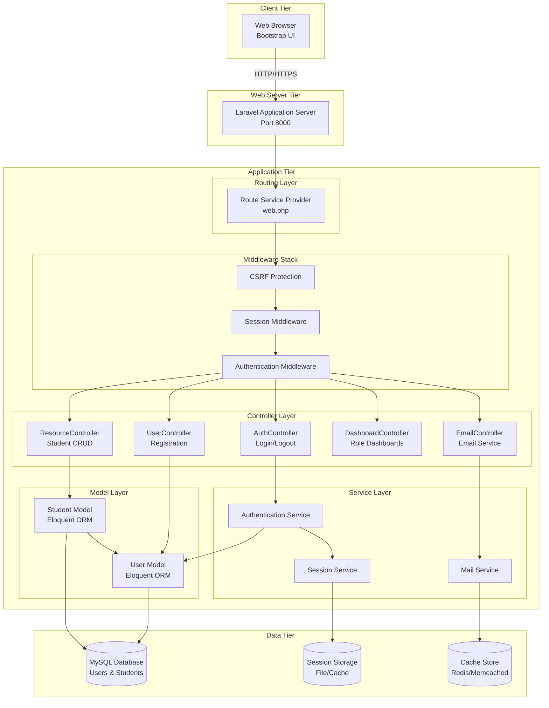

### Request-Response Cycle

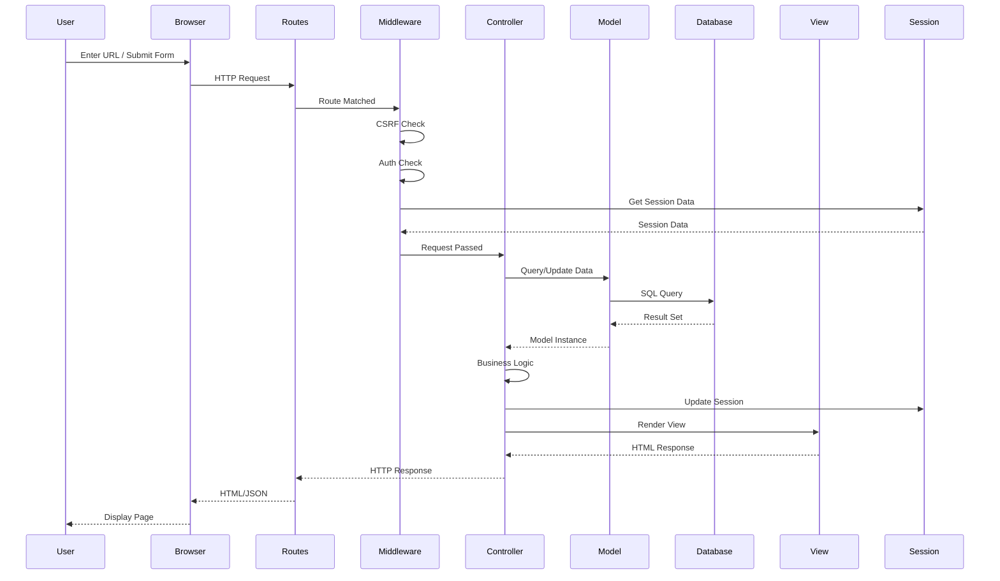

### Authentication Flow (Detailed)

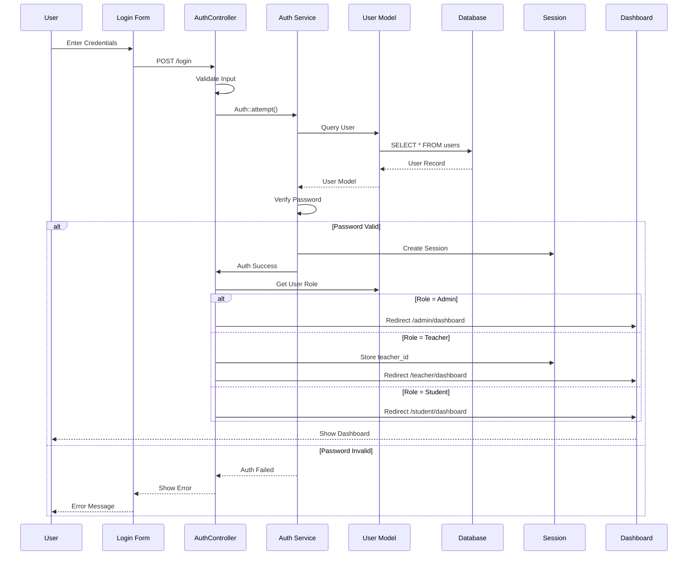

### Student CRUD Operations Flow

```mermaid
graph TB
    subgraph "Create Student"
        C1[Teacher clicks<br/>Add Student] --> C2[GET /students/create]
        C2 --> C3[Show Form]
        C3 --> C4[POST /students]
        C4 --> C5[Validate Input]
        C5 --> C6[Create Student Model]
        C6 --> C7[Save to Database]
        C7 --> C8[Redirect to List]
    end
    
    subgraph "Read Students"
        R1[Teacher clicks<br/>View Students] --> R2[GET /students]
        R2 --> R3[Get teacher_id from Session]
        R3 --> R4[Query Students WHERE teacher_id]
        R4 --> R5[Return View with Data]
    end
    
    subgraph "Update Student"
        U1[Teacher clicks<br/>Edit] --> U2[GET /students/edit?id=X]
        U2 --> U3[Load Student]
        U3 --> U4[Verify Ownership]
        U4 --> U5[Show Edit Form]
        U5 --> U6[PATCH /students/X]
        U6 --> U7[Validate & Update]
        U7 --> U8[Save Changes]
    end
    
    subgraph "Delete Student"
        D1[Teacher clicks<br/>Delete] --> D2[DELETE /students/X]
        D2 --> D3[Verify Ownership]
        D3 --> D4[Delete from DB]
        D4 --> D5[Redirect to List]
    end
```

### Email System Architecture

```mermaid
graph LR
    User[User] --> Form[Email Form<br/>/sendMail]
    Form --> Submit[POST /send-mail]
    Submit --> EC[EmailController]
    EC --> Validate[Validate Input]
    Validate --> Mail[Mail::to]
    Mail --> WE[WelcomeEmail<br/>Mailable]
    WE --> Config[Mail Configuration<br/>SMTP/Sendmail]
    Config --> Queue[Queue System<br/>Optional]
    Queue --> SMTP[SMTP Server]
    SMTP --> Recipient[Recipient Email]
```

---

## Data Flow

### Student Creation Flow

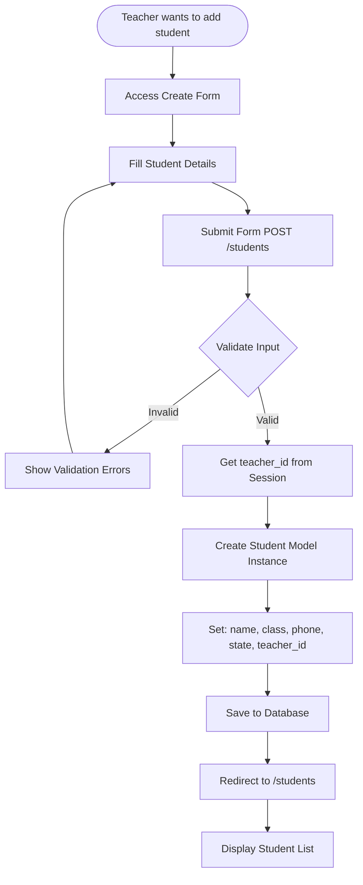

### Student Access Control Flow

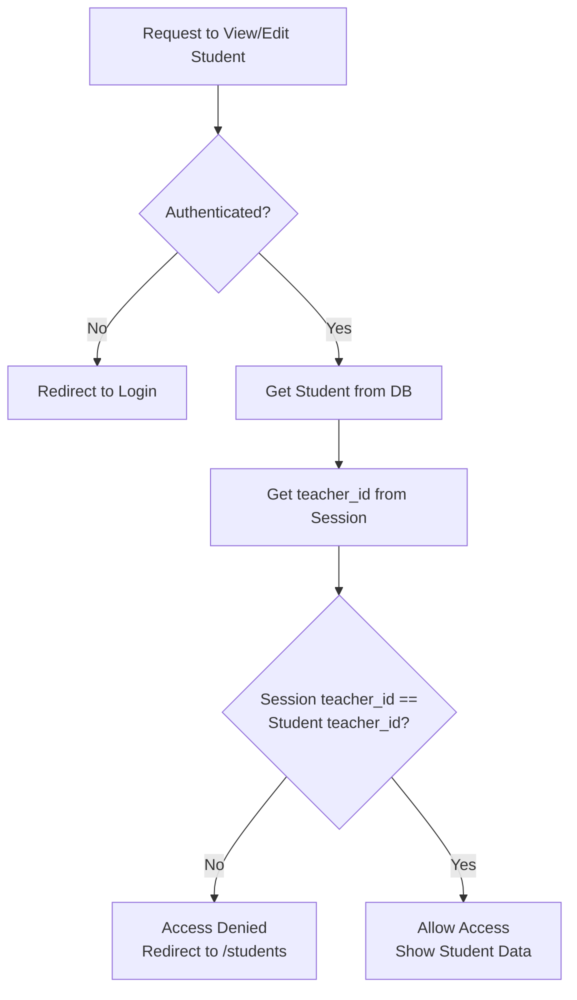

---

## Authentication Flow

### Login Process

```
┌─────────────────────────────────────────────────────────┐
│                   1. User Access                        │
│              GET /login → Login Form                     │
└─────────────────────────────────────────────────────────┘
                          ↓
┌─────────────────────────────────────────────────────────┐
│             2. Submit Credentials                       │
│         POST /login (email, password)                   │
└─────────────────────────────────────────────────────────┘
                          ↓
┌─────────────────────────────────────────────────────────┐
│             3. Input Validation                         │
│    Validate email format, password required              │
└─────────────────────────────────────────────────────────┘
                          ↓
┌─────────────────────────────────────────────────────────┐
│           4. Authentication Check                       │
│    Auth::attempt() → Query DB → Verify Password         │
└─────────────────────────────────────────────────────────┘
                          ↓
                    ┌─────┴─────┐
                    │           │
              ┌─────▼─────┐ ┌──▼──────┐
              │  Success  │ │  Fail   │
              └─────┬─────┘ └──┬──────┘
                    │           │
        ┌───────────┼───────────┼───────────┐
        │           │           │           │
┌───────▼───┐ ┌─────▼────┐ ┌───▼────┐ ┌───▼────┐
│   Admin   │ │ Teacher  │ │Student │ │ Error  │
└───────┬───┘ └─────┬────┘ └───┬────┘ └───┬────┘
        │           │           │         │
        └───────────┴───────────┴─────────┘
                    │
        ┌───────────▼───────────┐
        │  Create Session       │
        │  Store user data      │
        └───────────┬───────────┘
                    │
        ┌───────────▼───────────┐
        │  Role-Based Redirect  │
        │  /admin/dashboard     │
        │  /teacher/dashboard   │
        │  /student/dashboard   │
        └───────────────────────┘
```

### Session Management

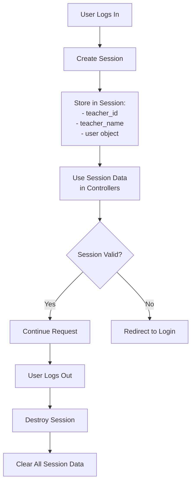

---

## Authorization Model

### Role-Based Access Control (RBAC)

```
┌─────────────────────────────────────────────────────────┐
│                      User Roles                          │
└─────────────────────────────────────────────────────────┘
         │              │              │
    ┌────▼────┐    ┌────▼────┐    ┌────▼────┐
    │  Admin  │    │ Teacher │    │ Student │
    └────┬────┘    └────┬────┘    └────┬────┘
         │              │              │
    ┌────▼────────────────────────────────────┐
    │         Permission Matrix               │
    ├─────────────────────────────────────────┤
    │ Feature        │ Admin │ Teacher │ Student│
    ├────────────────┼───────┼─────────┼────────┤
    │ View All Users │   ✓   │    ✗    │   ✗    │
    │ Create User    │   ✓   │    ✗    │   ✗    │
    │ View Students  │   ✓   │   ✓*   │   ✗    │
    │ Create Student │   ✓   │   ✓    │   ✗    │
    │ Edit Student   │   ✓   │   ✓*   │   ✗    │
    │ Delete Student │   ✓   │   ✓*   │   ✗    │
    │ View Dashboard │   ✓   │   ✓    │   ✓    │
    │ Send Email     │   ✓   │   ✓    │   ✗    │
    └────────────────┴───────┴─────────┴────────┘
    
    * = Only own students
```

### Access Control Implementation

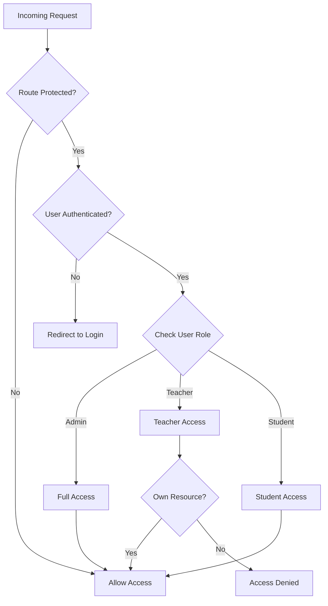

---

## Database Design

### Entity Relationship Diagram

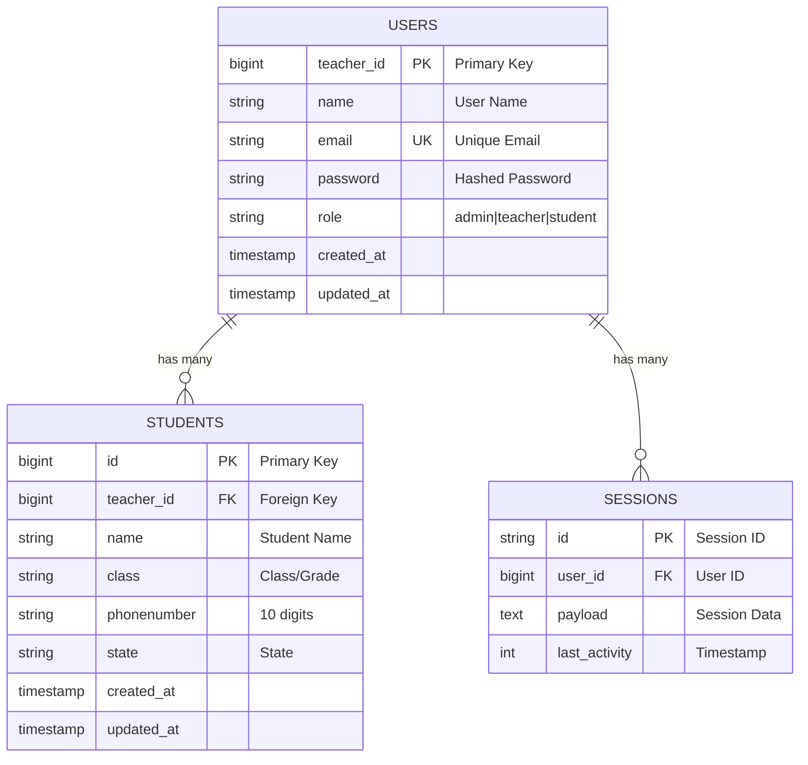

### Database Schema Details

#### Users Table Structure
```sql
CREATE TABLE users (
    teacher_id BIGINT PRIMARY KEY AUTO_INCREMENT,
    name VARCHAR(255) NOT NULL,
    email VARCHAR(255) UNIQUE NOT NULL,
    email_verified_at TIMESTAMP NULL,
    password VARCHAR(255) NOT NULL,
    role VARCHAR(255) DEFAULT 'teacher',
    remember_token VARCHAR(100) NULL,
    created_at TIMESTAMP NULL,
    updated_at TIMESTAMP NULL
);
```

#### Students Table Structure
```sql
CREATE TABLE student (
    id BIGINT PRIMARY KEY AUTO_INCREMENT,
    teacher_id BIGINT NOT NULL,
    name VARCHAR(255) NOT NULL,
    class VARCHAR(255) NOT NULL,
    phonenumber VARCHAR(10) NOT NULL,
    state VARCHAR(255) NOT NULL,
    created_at TIMESTAMP NULL,
    updated_at TIMESTAMP NULL,
    FOREIGN KEY (teacher_id) REFERENCES users(teacher_id) ON DELETE CASCADE
);
```

### Indexes and Constraints

- **Primary Keys**: `users.teacher_id`, `student.id`
- **Foreign Keys**: `student.teacher_id` → `users.teacher_id`
- **Unique Constraints**: `users.email`
- **Indexes**: Email (for fast lookups), teacher_id (for joins)

---

## Security Architecture

### Security Layers

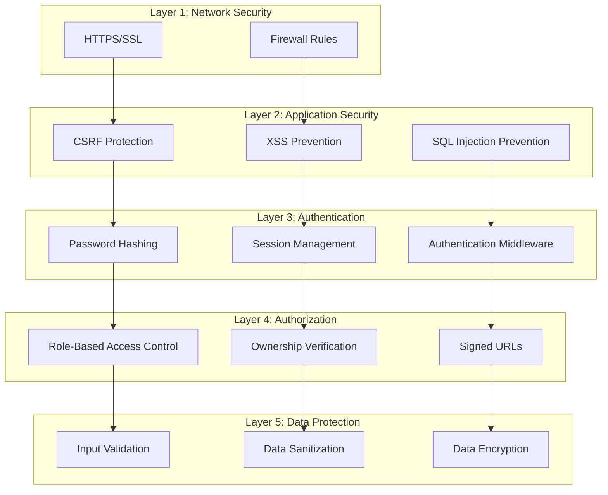

### Security Flow for Sensitive Operations

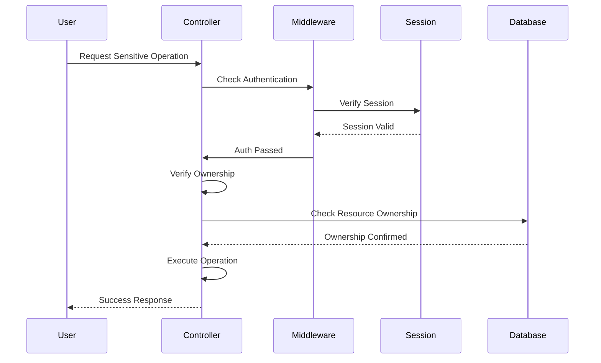

---

## Component Interactions

### Controller Dependencies

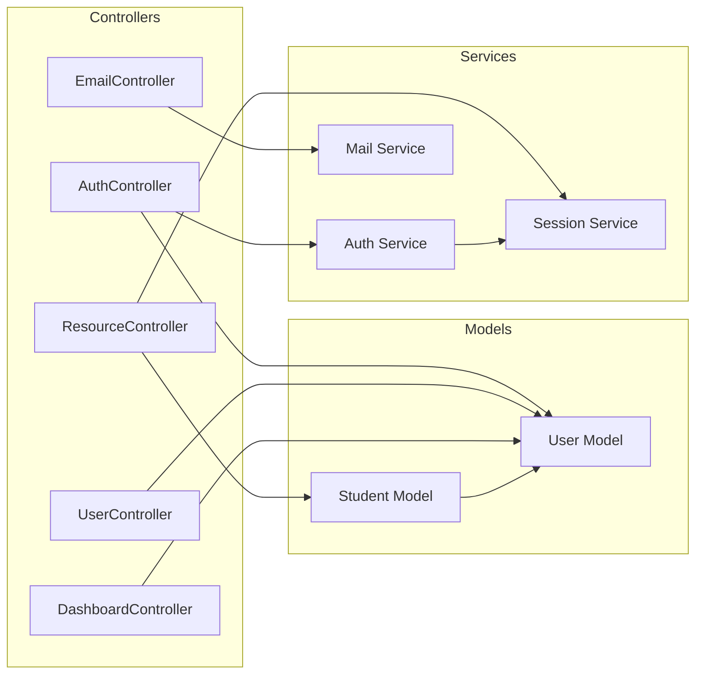

---

## Deployment Architecture

### Production Environment

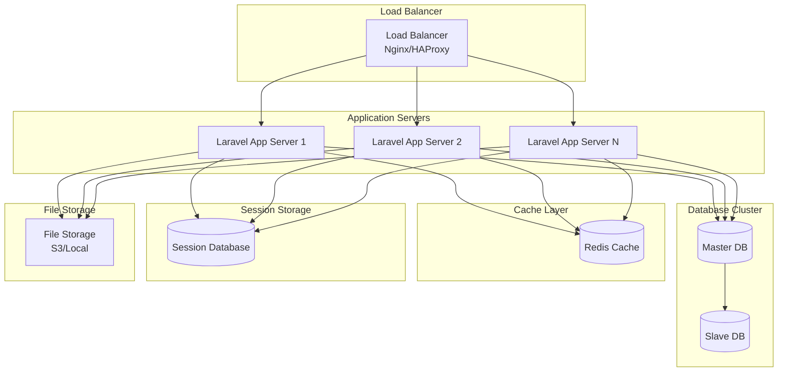

---

## Performance Considerations

### Caching Strategy

- **Session Caching**: Store sessions in Redis for faster access
- **Query Caching**: Cache frequently accessed data
- **View Caching**: Cache rendered Blade templates
- **Route Caching**: Cache route definitions in production

### Database Optimization

- **Indexes**: Proper indexing on foreign keys and frequently queried columns
- **Eager Loading**: Use Eloquent eager loading to prevent N+1 queries
- **Query Optimization**: Optimize complex queries with proper joins

---

## Future Enhancements

### Potential Architecture Improvements

1. **API Layer**: Add RESTful API with token authentication
2. **Queue System**: Implement job queues for email sending
3. **Event System**: Use Laravel events for decoupled components
4. **Repository Pattern**: Abstract data access layer
5. **Service Layer**: Extract business logic from controllers
6. **Caching Layer**: Implement Redis for session and data caching
7. **File Storage**: Migrate to cloud storage (S3)
8. **Real-time Features**: Add WebSocket support for notifications

---

## Conclusion

This architecture provides a solid foundation for the Student Management System with clear separation of concerns, security measures, and scalability considerations. The MVC pattern ensures maintainability, while the role-based access control provides security and proper user management.

