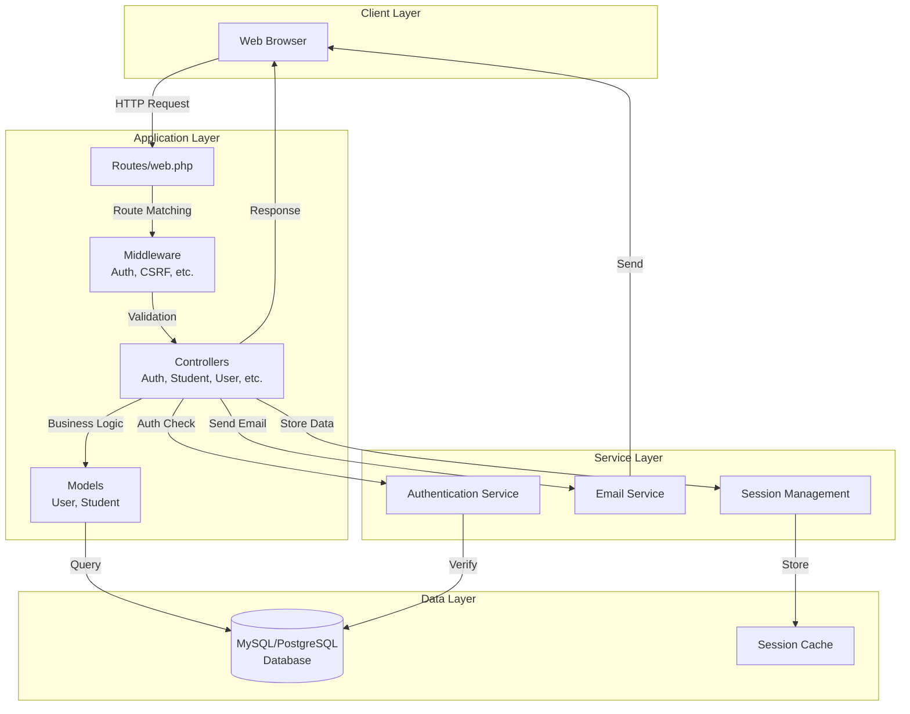
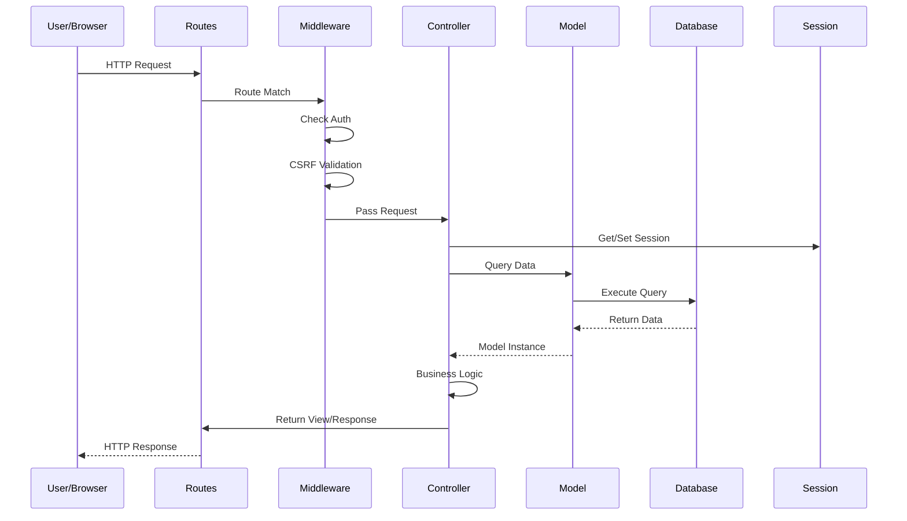
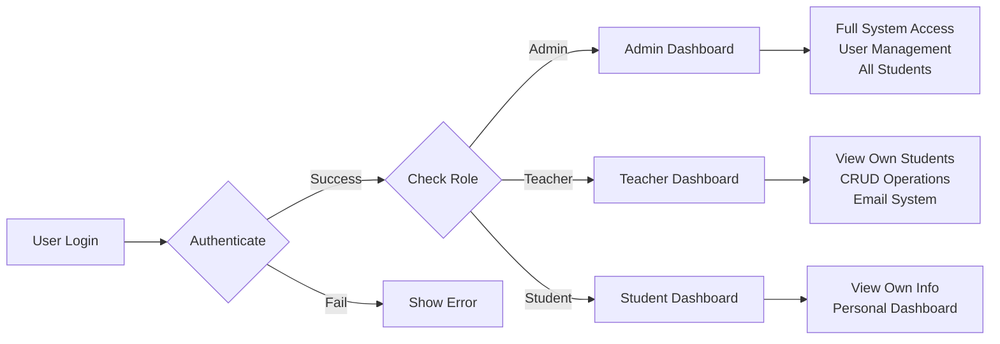
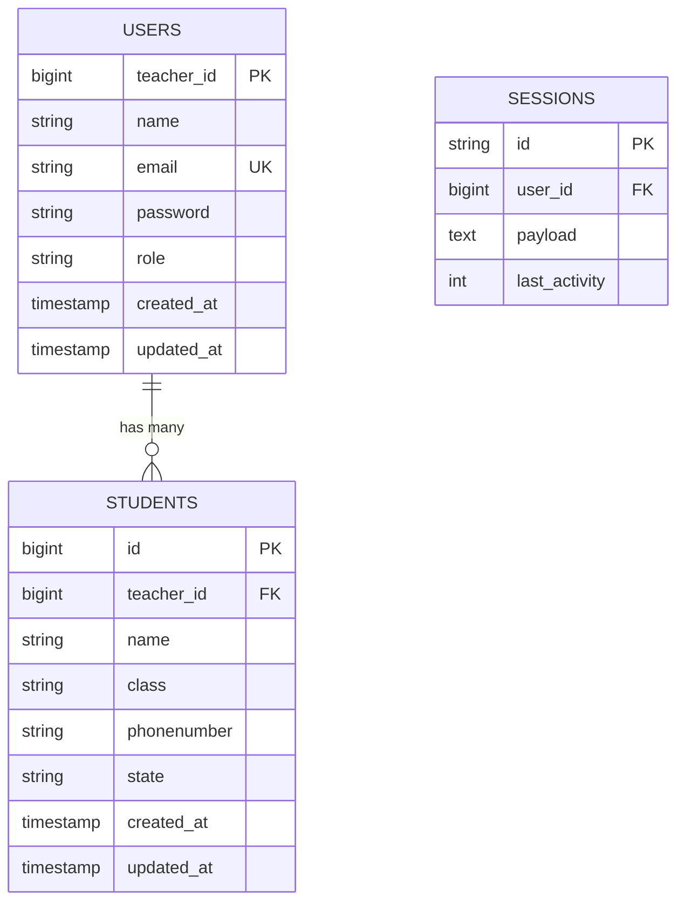
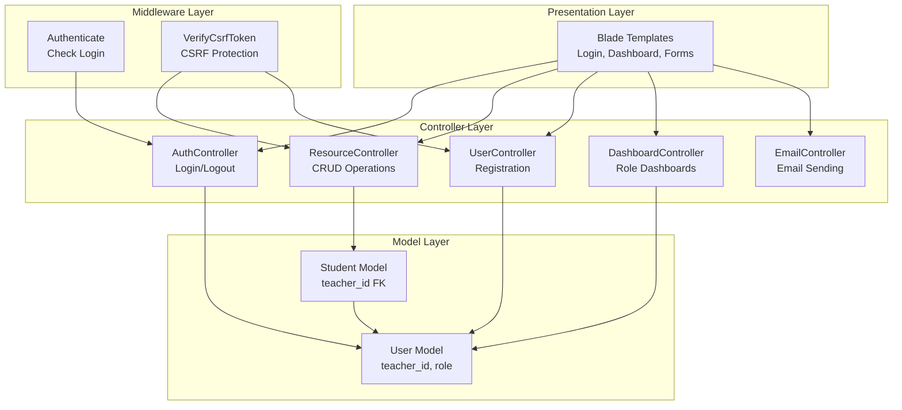

# 🎓 Student Management System

<div align="center">


A comprehensive **Role-Based Student Management System** built with Laravel 10, featuring multi-user authentication, student CRUD operations, and email notifications.

[Features](#-features) • [Installation](#-installation) • [Architecture](#-architecture) • [Documentation](#-documentation)

</div>

---

## 📋 Table of Contents

- [Overview](#-overview)
- [Features](#-features)
- [Technology Stack](#-technology-stack)
- [Architecture](#-architecture)
- [Installation](#-installation)
- [Configuration](#-configuration)
- [Usage Guide](#-usage-guide)
- [Database Schema](#-database-schema)
- [API Routes](#-api-routes)
- [Security Features](#-security-features)
- [Project Structure](#-project-structure)
- [Contributing](#-contributing)
- [License](#-license)

---

## 🎯 Overview

The **Student Management System** is a web-based application designed for educational institutions to manage student-teacher relationships efficiently. The system provides role-based access control with three distinct user roles:

- **👨‍💼 Admin**: Full system access and user management
- **👨‍🏫 Teacher**: Manage assigned students (CRUD operations)
- **👨‍🎓 Student**: View personal dashboard and information

### Key Highlights

- ✅ **Role-Based Access Control (RBAC)** with secure authentication
- ✅ **Student Management** with full CRUD operations
- ✅ **Teacher-Student Relationship** mapping
- ✅ **Email Notification System** for communications
- ✅ **Session-Based Authentication** with secure logout
- ✅ **Input Validation** and security measures
- ✅ **Responsive UI** with Bootstrap 5

---

## ✨ Features

### Authentication & Authorization
- 🔐 Secure login system with email/password authentication
- 🔑 Role-based access control (Admin, Teacher, Student)
- 🚪 Automatic role-based dashboard redirection after login
- 📝 User registration with role assignment
- 🔒 Session management with secure logout

### Student Management
- ➕ **Create**: Add new students with validation
- 📋 **Read**: View all students (filtered by teacher)
- ✏️ **Update**: Edit student information
- 🗑️ **Delete**: Remove students with ownership verification
- 🔍 **View**: Individual student details with access control
- 🗂️ **Bulk Operations**: Delete all students (admin only)

### Additional Features
- 📧 **Email System**: Send notifications via Laravel Mail
- 🎨 **Modern UI**: Bootstrap 5 responsive design
- 🔒 **Security**: CSRF protection, password hashing, input validation
- 📊 **Dashboard**: Role-specific dashboards for each user type
- 🔗 **Signed URLs**: Secure deletion links with one-time tokens

---

## 🛠️ Technology Stack

### Backend
- **Framework**: Laravel 10.x
- **Language**: PHP 8.1+
- **Database**: MySQL/PostgreSQL (via Eloquent ORM)
- **Authentication**: Laravel Sanctum + Session-based auth

### Frontend
- **Templating**: Blade Templates
- **CSS Framework**: Bootstrap 5.3.2
- **JavaScript**: Vanilla JS (via Bootstrap)

### Key Packages
- `laravel/sanctum` - API authentication
- `vinkla/hashids` - ID hashing/obfuscation
- `guzzlehttp/guzzle` - HTTP client
- `laravel/tinker` - REPL for Laravel

### Development Tools
- `phpunit/phpunit` - Testing framework
- `laravel/pint` - Code style fixer
- `fakerphp/faker` - Fake data generation

---

## 🏗️ Architecture

### System Architecture Diagram



### Request Flow Architecture



### Role-Based Access Control Flow



### Database Relationship Diagram



### Component Architecture



---

## 📦 Installation

### Prerequisites

- PHP >= 8.1
- Composer
- MySQL/PostgreSQL
- Node.js & NPM (for frontend assets)

### Step-by-Step Installation

1. **Clone the repository**
   ```bash
   git clone <repository-url>
   cd student-management/LoginApp
   ```

2. **Install PHP dependencies**
   ```bash
   composer install
   ```

3. **Install Node dependencies**
   ```bash
   npm install
   ```

4. **Environment Configuration**
   ```bash
   cp .env.example .env
   php artisan key:generate
   ```

5. **Configure Database**
   Edit `.env` file:
   ```env
   DB_CONNECTION=mysql
   DB_HOST=127.0.0.1
   DB_PORT=3306
   DB_DATABASE=student_management
   DB_USERNAME=your_username
   DB_PASSWORD=your_password
   ```

6. **Run Migrations**
   ```bash
   php artisan migrate
   ```

7. **Seed Database (Optional)**
   ```bash
   php artisan db:seed
   ```

8. **Create Storage Link**
   ```bash
   php artisan storage:link
   ```

9. **Start Development Server**
   ```bash
   php artisan serve
   ```

10. **Build Frontend Assets (Optional)**
    ```bash
    npm run dev
    # or for production
    npm run build
    ```

The application will be available at `http://localhost:8000`

---

## ⚙️ Configuration

### Environment Variables

Key environment variables in `.env`:

```env
APP_NAME="Student Management System"
APP_ENV=local
APP_KEY=base64:...
APP_DEBUG=true
APP_URL=http://localhost:8000

DB_CONNECTION=mysql
DB_HOST=127.0.0.1
DB_PORT=3306
DB_DATABASE=student_management
DB_USERNAME=root
DB_PASSWORD=

MAIL_MAILER=smtp
MAIL_HOST=mailpit
MAIL_PORT=1025
MAIL_USERNAME=null
MAIL_PASSWORD=null
MAIL_ENCRYPTION=null
MAIL_FROM_ADDRESS="hello@example.com"
MAIL_FROM_NAME="${APP_NAME}"

SESSION_DRIVER=file
SESSION_LIFETIME=120
```

### Mail Configuration

For email functionality, configure your mail settings:

```env
MAIL_MAILER=smtp
MAIL_HOST=smtp.gmail.com
MAIL_PORT=587
MAIL_USERNAME=your-email@gmail.com
MAIL_PASSWORD=your-app-password
MAIL_ENCRYPTION=tls
```

---

## 📖 Usage Guide

### Creating a User

1. Navigate to `/createUser`
2. Fill in the registration form:
   - Name
   - Email
   - Password
   - Role (Admin, Teacher, or Student)
3. Submit the form
4. You'll be redirected to the login page

### Logging In

1. Go to `/login`
2. Enter your email and password
3. You'll be redirected based on your role:
   - **Admin** → `/admin/dashboard`
   - **Teacher** → `/teacher/dashboard`
   - **Student** → `/student/dashboard`

### Teacher Workflow

1. **View Students**: Click "View All Students" from dashboard
2. **Add Student**: Click "Add New Student" and fill the form
3. **Edit Student**: Navigate to edit form and update information
4. **Delete Student**: Use delete button (with confirmation)
5. **View Single Student**: Click on student to view details

### Admin Workflow

- Access to all system features
- User management
- View all students across all teachers

### Sending Emails

1. Navigate to `/sendMail`
2. Fill in recipient email, subject, and message
3. Submit to send email

---

## 🗄️ Database Schema

### Users Table

| Column | Type | Description |
|--------|------|-------------|
| `teacher_id` | bigint (PK) | Primary key (custom) |
| `name` | string | User's full name |
| `email` | string (unique) | User's email address |
| `password` | string (hashed) | Encrypted password |
| `role` | string | User role (admin/teacher/student) |
| `created_at` | timestamp | Record creation time |
| `updated_at` | timestamp | Record update time |

### Students Table

| Column | Type | Description |
|--------|------|-------------|
| `id` | bigint (PK) | Primary key |
| `teacher_id` | bigint (FK) | Foreign key to users.teacher_id |
| `name` | string | Student's name |
| `class` | string | Student's class/grade |
| `phonenumber` | string | 10-digit phone number |
| `state` | string | Student's state |
| `created_at` | timestamp | Record creation time |
| `updated_at` | timestamp | Record update time |

### Relationships

- **User hasMany Students**: One teacher can have multiple students
- **Student belongsTo User**: Each student belongs to one teacher

---

## 🛣️ API Routes

### Public Routes

| Method | Route | Controller | Description |
|--------|-------|------------|-------------|
| GET | `/` | - | Welcome page |
| GET | `/login` | AuthController@loginForm | Show login form |
| POST | `/login` | AuthController@loginCheck | Process login |
| GET | `/createUser` | UserController@create | Show registration form |
| POST | `/createUser` | UserController@store | Process registration |

### Protected Routes (Require Authentication)

#### Dashboard Routes
| Method | Route | Controller | Description |
|--------|-------|------------|-------------|
| GET | `/teacher/dashboard` | DashboardController@teacher | Teacher dashboard |
| GET | `/admin/dashboard` | DashboardController@admin | Admin dashboard |
| GET | `/student/dashboard` | DashboardController@student | Student dashboard |

#### Student Management Routes
| Method | Route | Controller | Description |
|--------|-------|------------|-------------|
| GET | `/students` | resourceController@index | List all students |
| GET | `/students/create` | resourceController@create | Show create form |
| POST | `/students` | resourceController@store | Store new student |
| GET | `/students/view` | resourceController@show | View single student |
| GET | `/students/edit` | resourceController@editForm | Show edit form |
| PATCH | `/students/{id}` | resourceController@update | Update student |
| DELETE | `/students/{id}` | resourceController@destroy | Delete student |
| POST | `/students/deleteAll` | resourceController@deleteAll | Delete all students |
| POST | `/students/{id}/delete-link` | resourceController@deleteViaLink | Delete via signed URL |

#### Other Routes
| Method | Route | Controller | Description |
|--------|-------|------------|-------------|
| POST | `/logout` | AuthController@logout | Logout user |
| GET | `/sendMail` | - | Show email form |
| POST | `/send-mail` | EmailController@sendEmail | Send email |
| GET | `/teacher/all` | UserController@index | List all teachers |
| GET | `/students/all` | StudentController@index | List all students |

---

## 🔒 Security Features

### Authentication & Authorization
- ✅ Password hashing using `bcrypt`
- ✅ CSRF token protection on all forms
- ✅ Session-based authentication
- ✅ Role-based access control (RBAC)
- ✅ Middleware protection on sensitive routes

### Data Protection
- ✅ Input validation on all forms
- ✅ SQL injection prevention (Eloquent ORM)
- ✅ XSS protection (Blade templating)
- ✅ Ownership verification before data access
- ✅ Signed URLs for secure deletion links
- ✅ One-time tokens for sensitive operations

### Best Practices
- ✅ Environment-based configuration
- ✅ Secure session management
- ✅ Error handling without exposing sensitive data
- ✅ Email validation
- ✅ Phone number format validation (10 digits)

---

## 📁 Project Structure

```
LoginApp/
├── app/
│   ├── Console/              # Artisan commands
│   ├── Exceptions/           # Exception handlers
│   ├── Http/
│   │   ├── Controllers/      # Application controllers
│   │   │   ├── AuthController.php
│   │   │   ├── DashboardController.php
│   │   │   ├── resourceController.php
│   │   │   ├── UserController.php
│   │   │   ├── StudentController.php
│   │   │   └── EmailController.php
│   │   ├── Middleware/       # Custom middleware
│   │   └── Kernel.php        # HTTP kernel
│   ├── Mail/                 # Mail classes
│   │   └── WelcomeEmail.php
│   ├── Models/               # Eloquent models
│   │   ├── User.php
│   │   └── Student.php
│   └── Providers/            # Service providers
├── bootstrap/                # Application bootstrap
├── config/                   # Configuration files
├── database/
│   ├── factories/            # Model factories
│   ├── migrations/           # Database migrations
│   └── seeders/              # Database seeders
├── public/                   # Public assets
├── resources/
│   ├── css/                  # Stylesheets
│   ├── js/                   # JavaScript
│   └── views/                # Blade templates
│       ├── Admin/
│       ├── Student/
│       ├── LoginPage.blade.php
│       ├── Dashboard.blade.php
│       ├── studentsTable.blade.php
│       └── ...
├── routes/
│   ├── web.php               # Web routes
│   └── api.php               # API routes
├── storage/                   # Storage files
├── tests/                     # Test files
├── vendor/                    # Composer dependencies
├── .env                      # Environment configuration
├── composer.json             # PHP dependencies
├── package.json              # Node dependencies
└── README.md                 # This file
```

---

## 🧪 Testing

Run the test suite:

```bash
php artisan test
```

Or using PHPUnit directly:

```bash
vendor/bin/phpunit
```

---

## 🤝 Contributing

Contributions are welcome! Please follow these steps:

1. Fork the repository
2. Create a feature branch (`git checkout -b feature/amazing-feature`)
3. Commit your changes (`git commit -m 'Add some amazing feature'`)
4. Push to the branch (`git push origin feature/amazing-feature`)
5. Open a Pull Request

### Code Style

The project uses Laravel Pint for code formatting:

```bash
./vendor/bin/pint
```

---

## 📝 License

This project is open-sourced software licensed under the [MIT license](https://opensource.org/licenses/MIT).

---

## 👥 Authors

- **Your Name** - *Initial work*

---

## 🙏 Acknowledgments

- Laravel framework and community
- Bootstrap for the UI framework
- All contributors and users of this project

---

## 📞 Support

For support, email your-email@example.com or create an issue in the repository.

---

<div align="center">

**Made with ❤️ using Laravel**

⭐ Star this repo if you find it helpful!

</div>
